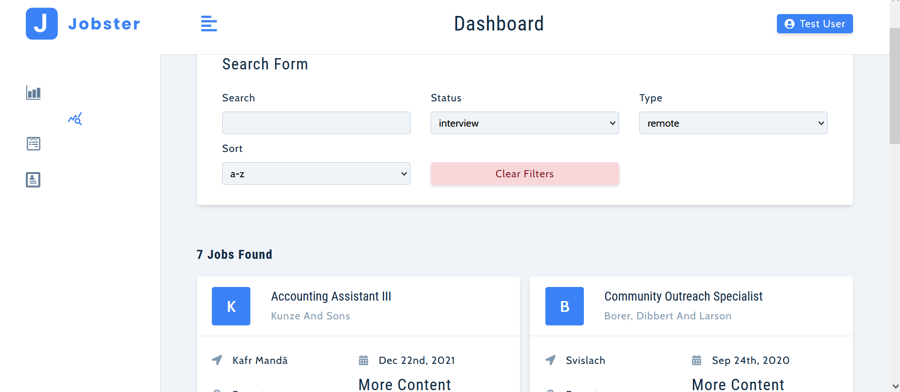

# Joby
**Joby is an React App, designed to your job applications.** 

 

 

## Getting started 

1. Open the client folder and run in the terminal. \
    `npm i` 
2. Start the app by typing \
   `npm start`

## Tech stack
- [Typescript](https://www.typescriptlang.org/)
- [React](reactjs.org/)
- [Redux](https://redux-toolkit.js.org/)